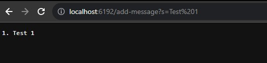
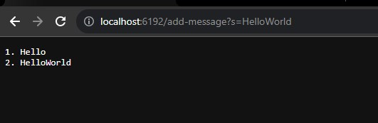
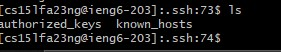
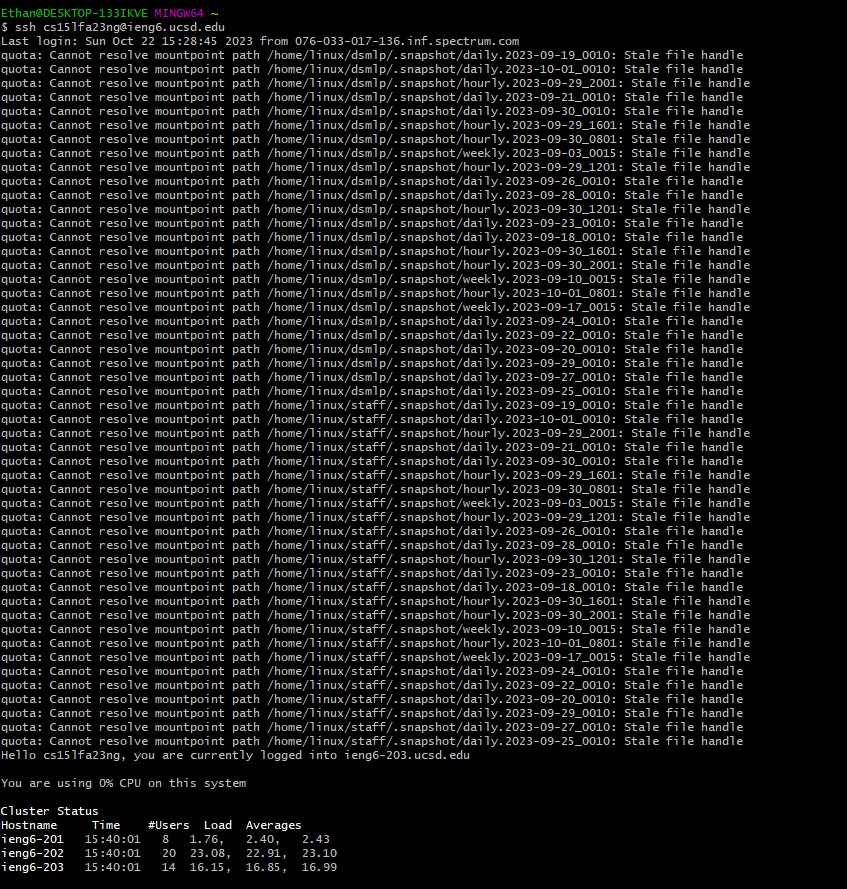

# Lab Report 2
---
Part 1
---

Here is the code for my StringServer File (includes the main class and URLHandler class):
```
import java.io.IOException;
import java.net.URI;
import java.util.ArrayList;

class Handler implements URLHandler {
    // The one bit of state on the server: a number that will be manipulated by
    // various requests.
    int num = 0;
    int sequence = 0;
    ArrayList messages = new ArrayList();

    public String handleRequest(URI url) {
        
        if (url.getPath().equals("/")) {
            return String.format("Number: %d", num);
        } else if (url.getPath().equals("/increment")) {
            num += 1;
            return String.format("Number incremented!");
        } else {
            if (url.getPath().contains("/add-message")) {
                // parameter[0] = s &  [1]= Hello
                String[] parameters = url.getQuery().split("=");
                if (parameters.length >= 2 && parameters[0].equals("s")) {
                    String output = "";
                    int sequence = 1;

                    messages.add(parameters[1]);
                    for (int i = 0; i < messages.size(); i++){
                        output += sequence + ". " + messages.get(i) + "\n";
                        sequence++;
                    } 
                    
                    return output;
                } else {
                    return "Invalid format: Enter s=(insert value here)";
                }
            }
            return "404 Not Found!";
        }
    }
}

class StringServer {
    public static void main(String[] args) throws IOException {
        if(args.length == 0){
            System.out.println("Missing port number! Try any number between 1024 to 49151");
            return;
        }

        int port = Integer.parseInt(args[0]);

        Server.start(port, new Handler());
    }
}
```



- The methods called for the first test are my main method, StringServer, which will be followed up by the Handler method.
- The relevant arguments are the port for the main method, the url for the handler method, and the input for the query.
- An example of values affecting the fields is if you were to exclude s= or any value after the -. The index would still increment so that even if you did correct it after, the values would be n+1. I wrote an exception handler to handle this.


-  The methods called for the first test are still my main method, StringServer, which will be followed up by the Handler method once again.
-  The relevant arguments are still the port and the URL and also the input once again.
-  I messed around by putting no input and also with the spacing (not depicted in the screenshots) and while they were handled thanks to my exception handler, they definitely would've altered the output.

Part 2
---

Below is the ls to show the path where the ssh keys are stored:



Below is an image of me logging in without typing in the password thanks to the key:



Part 3
---

This lab and week, in general, helped me further develop my understanding of the command prompt commands and Java. I feel a lot more comfortable working in the lab and with the material now that I'm more familiar with the tools and techniques we've learned over the past few weeks. Overall, this week allowed me to practice the tools and techniques we've learned.
